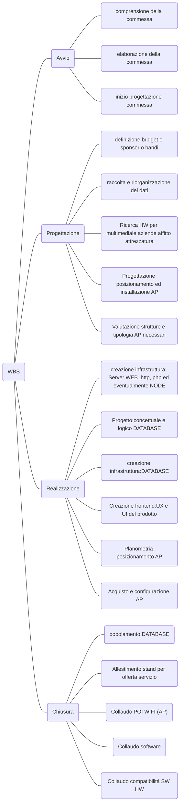

```mermaid
graph LR
    start(WBS) --- A(Avvio)
    A(Avvio) --- A1(comprensione della commessa)
    A(Avvio) --- A2(elaborazione della commessa)
    A(Avvio) --- A3(inizio progettazione commessa)

    start(WBS) --- B(Progettazione)
    B(Progettazione) --- B1(definizione budget e sponsor o bandi)
    B(Progettazione) --- B2(raccolta e riorganizzazione dei dati)
    B(Progettazione) --- B3(Ricerca HW per multimediale aziende affitto attrezzatura)
    B(Progettazione) --- B4(Progettazione posizionamento ed installazione AP)
    B(Progettazione) --- B5(Valutazione strutture e tipologia AP necessari)


    start(WBS) --- C(Realizzazione)
    C(Realizzazione) --- C1("creazione infrastruttura: Server WEB ,http, php ed eventualmente NODE")
    C(Realizzazione) --- C2("Progetto:concettuale e logico DATABASE")
    C(Realizzazione) --- C3(creazione infrastruttura:DATABASE)
    C(Realizzazione) --- C4("Creazione frontend:UX e UI del prodotto")
    C(Realizzazione) --- C5("Planometria posizionamento AP")
    C(Realizzazione) --- C6("Acquisto e configurazione AP")


    start(WBS) --- D(Chiusura)
    D(Chiusura) --- D1(popolamento DATABASE)
    D(Chiusura) --- D2(Allestimento stand per offerta servizio)
    D(Chiusura) --- D3("Collaudo POI WIFI (AP)")
    D(Chiusura) --- D4(Collaudo software )
    D(Chiusura) --- D5(Collaudo compatibilitá SW HW)
```