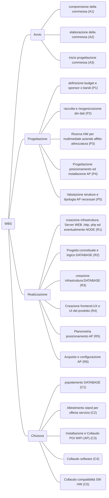

```mermaid
graph LR
    start(WBS) --- A(Avvio)
    A(Avvio) --- A1("comprensione della commessa (A1)")
    A(Avvio) --- A2("elaborazione della commessa (A2)")
    A(Avvio) --- A3("inizio progettazione commessa (A3)")

    start(WBS) --- B(Progettazione)
    B(Progettazione) --- B1("definizione budget e sponsor o bandi (P1)")
    B(Progettazione) --- B2("raccolta e riorganizzazione dei dati (P2)")
    B(Progettazione) --- B3("Ricerca HW per multimediale aziende affitto attrezzatura (P3)")
    B(Progettazione) --- B4("Progettazione posizionamento ed installazione AP (P4)")
    B(Progettazione) --- B5("Valutazione strutture e tipologia AP necessari (P5)")


    start(WBS) --- C(Realizzazione)
    C(Realizzazione) --- C1("creazione infrastruttura: Server WEB ,http, php ed eventualmente NODE (R1)")
    C(Realizzazione) --- C2("Progetto:concettuale e logico DATABASE (R2)")
    C(Realizzazione) --- C3("creazione infrastruttura:DATABASE (R3)")
    C(Realizzazione) --- C4("Creazione frontend:UX e UI del prodotto (R4)")
    C(Realizzazione) --- C5("Planometria posizionamento AP (R5)")
    C(Realizzazione) --- C6("Acquisto e configurazione AP (R6)")


    start(WBS) --- D(Chiusura)
    D(Chiusura) --- D1("popolamento DATABASE (C1)")
    D(Chiusura) --- D2("Allestimento stand per offerta servizio (C2)")
    D(Chiusura) --- D3("Installazione e Collaudo POI WIFI (AP) (C3)")
    D(Chiusura) --- D4("Collaudo software (C4)")
    D(Chiusura) --- D5("Collaudo compatibilitá SW HW (C5)")
```